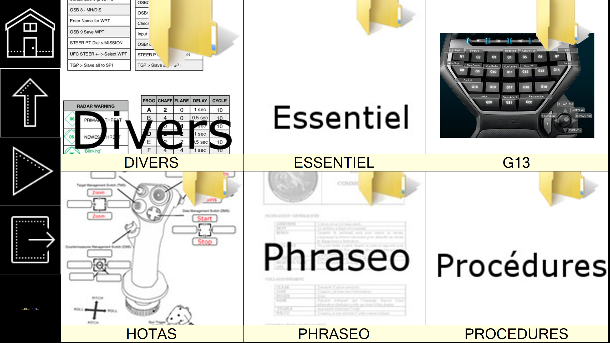

# SideScreen2

***Calexo SideScreen2 - Kneeboard for all***

## Whats is SideScreen 2 ?

SideScreen 2 allows you to use a touchscreen display as a Kneeboard.



You can use any computer running .NET Framework, even with Mono (includes Raspberry Pi, from version 1).

https://youtu.be/2VlUsvCgALI


## Where do I put pictures ?

Put them in `data` directory of the executables.
```
pi@sidescreen2 ~/SideScreen2 $ ls
data  SideScreen2.exe  SideScreen2.exe.config  SideScreen2.pdb
```

## How can I use it on Raspberry Pi

### Hardware

You need :
 - A Raspberry Pi, with its SD card and its power supply
   - In the video, it is an old Raspberry Pi 1 B !
 - A compatible touchscreen
   - In the video, you can see the [official 7" touchscreen](https://www.kubii.fr/ecrans-afficheurs/1131-ecran-tactile-officiel-7-800x480-kubii-640522710829.html).

### On Raspbian

#### Install Mono

`sudo apt-get install mono-devel`

#### Activate Kiosk mode

Dans `/.config/lxsession/LXDE-pi/autostart` remplacez
```
    @lxpanel --profile LXDE
    @pcmanfm --desktop --profile LXDE
```

par
```
    mono /home/pi/SideScreen2 SideScreen2.exe`
```

Par exemple :

```
    #@lxpanel --profile LXDE-pi
    #@pcmanfm --desktop --profile LXDE-pi
    @xscreensaver -no-splash
    @/usr/lib/vino/vino-server
    mono /home/pi/SideScreen2/SideScreen2.exe
    @xset s noblank
    @xset s off
    @xset -dpms
```

## Task list
 
 - [x] Labels under boxes
 - [x] Optimization : generating thumbnails
 - [x] Slideshow
 - [ ] Web browser
 - [ ] Debug mode is an option
 - [ ] Separated thread for generating thumbnails
 - [ ] Slideshow slide time parameter
 - [ ] Hide Quit button when Kiosk mode
 - [ ] Parameters for number of boxes
 - [ ] Multipage
 